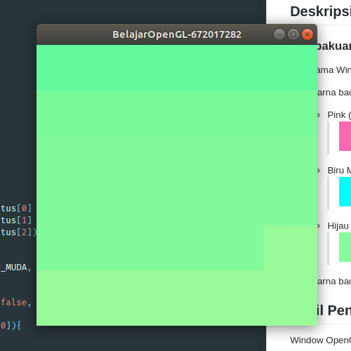

> Tugas Ini di rilis oleh  **Erlangga Ibrahim** secara terbuka (*Open Source*)
> Dibawah Lisensi **GNU GPLv3**. untuk keterangan dan informasi lebih lanjut mengenai
> Lisensi, dapat dibuka di : https://www.gnu.org/licenses/gpl-3.0.en.html
> atau dengan membaca file `LICENSE`

> Semua sumber yang digunakan pada tugas ini, dapat dilihat pada :
> https://github.com/wowotek/Grafkom-Dosen-Tugas2

> **PERINGATAN** : *Tugas ini dirilis **setelah tenggat waktu** pengumpulan tugas, dan tidak akan berlaku untuk kolega dengan tenggat waktu pengumpulan yang sama*

> **PERINGATAN** : *Tugas ini dirilis **tanpa garansi**, termasuk nilai yang di-nihilkan oleh sebab **mencontek** dan/atau **menyalin** dan/atau **meniru** yang bersumber dari tugas ini*
# Grafkom-Dosen-Tugas2
## Penulis
* Nama : **Erlangga Ibrahim**
* NIM : **672017282**
## Deskripsi Tugas
### Pembakuan :
1. Nama Window menjadi “BelajarOpenGL-NIM”
2. Warna background menjadi:
    * Pink (kode hex: `0xFF69B4`) 
        > 
    * Biru Muda (kode hex: `0x00FFFF`)
        > 
    * Hijau Muda (kode hex: `0x98FB98`)
        > 

3. Warna background yang berubah setiap detiknya (Minimal 3 warna).

## Hasil Pengerjaan
Window OpenGL di inisialisasikan sebesar `400px` x `400px`, dengan `Double Buffer` dan `RGB` switch.
```C++
glutInitDisplayMode(GLUT_DOUBLE | GLUT_RGB);
glutInitWindowSize(400, 400);
```
Untuk mensimulasikan background, saya menggunakan `GL_POLYGON` berbentuk persegi, sebesar window OpenGL.
```c++
glBegin(GL_POLYGON);
    glVertex(0, 1);
    glVertex(1, 1);
    glVertex(1, 0);
    glVertex(1, 0);
glEnd();
```
Dengan Warna RGB yang di simpan dalam variable global. yang akan di assign sesuai dengan target warna tertentu

```c++
GLfloat r, g, b
GLint targetColor[3][3] = {
    {100,  41,  71}, // PINK
    {  0, 100, 100}, // BIRU_MUDA
    { 60,  98,  60}  // HIJAU_MUDA
}
```
Perubahan Warna diatur didalam fungsi `changeColorSubRoutine` yang dipanggil setiap 1/120 detik, dan di render didalam fungsi `renderDisplay`
```c++
int main(int argc, char ** argv){
    /* ... */

    glutDisplayFunc(renderDisplay);
    changeColorSubRoutine(1000/120); // 1000 ms / 120

    /* ... */
}

void changeColorSubRoutine (int ms) {
    /* ... */
    /* IMPLEMENTASI PERUBAHAN WARNA DISINI */
    /* ... */

    glutPostRedisplay();
    glutTimerFunc(ms, changeColorSubRoutine, ms);
}
```
## ScreenShot





## Kompilasi Source Code
### GNU/Linux
```bash
g++ src/main.cpp -lGL -lGLU -lglut -Wall -o main.out
```
### Windows
```powershell
# todo add how to compile in windows
```